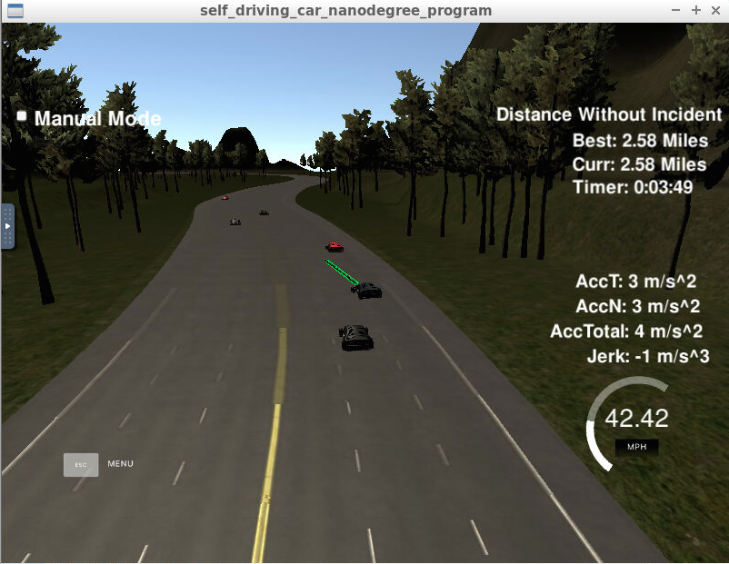
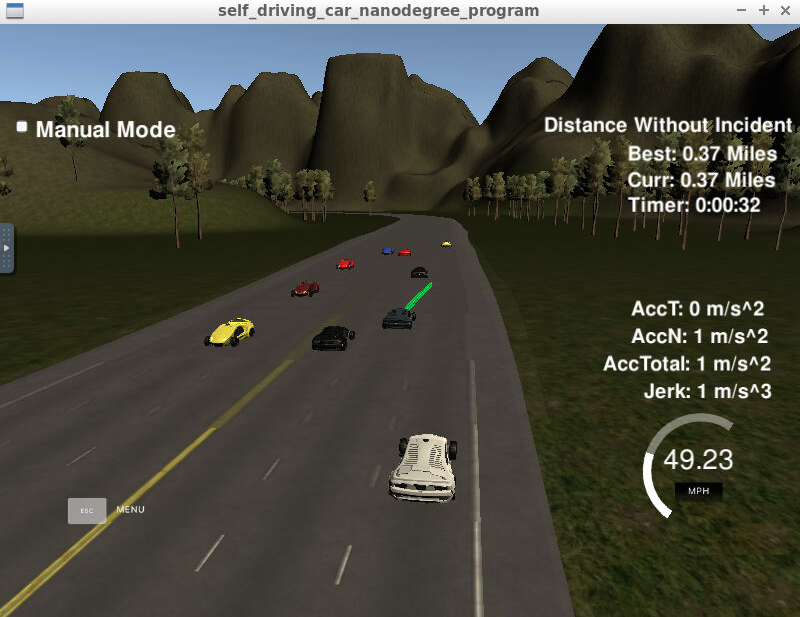

# CarND-Path-Planning-Project
A project in the Self-Driving Car Engineer Nanodegree Program

For implementation details, see the second part.

---
### Goals
In this project your goal is to safely navigate around a virtual highway with other traffic that is driving +-10 MPH of the 50 MPH speed limit. You will be provided the car's localization and sensor fusion data, there is also a sparse map list of waypoints around the highway. The car should try to go as close as possible to the 50 MPH speed limit, which means passing slower traffic when possible, note that other cars will try to change lanes too. The car should avoid hitting other cars at all cost as well as driving inside of the marked road lanes at all times, unless going from one lane to another. The car should be able to make one complete loop around the 6946m highway. Since the car is trying to go 50 MPH, it should take a little over 5 minutes to complete 1 loop. Also the car should not experience total acceleration over 10 m/s^2 and jerk that is greater than 10 m/s^3.

#### Map
The map of the highway is in data/highway_map.txt. Each waypoint in the list contains [id,x,y,s,dx,dy] values. x and y are the waypoint's map coordinate position, the s value is the distance along the road to get to that waypoint in meters, the dx and dy values define the unit normal vector pointing outward of the highway loop.

The highway's waypoints loop around, So the frenet s value, distance along the road, goes from 0 to 6945.554.

#### Data from the Simulator
1. Car localization Data (No Noise)
- ["x"] The car's x position in map coordinates
- ["y"] The car's y position in map coordinates
- ["s"] The car's s position in frenet coordinates
- ["d"] The car's d position in frenet coordinates
- ["yaw"] The car's yaw angle in the map
- ["speed"] The car's speed in MPH

2. Previous path data given to the Planner from the Simulator
- ["previous_path_x"] The previous list of x points previously given to the simulator
- ["previous_path_y"] The previous list of y points previously given to the simulator

3. Previous path's end s and d values
- ["end_path_s"] The previous list's last point's frenet s value
- ["end_path_d"] The previous list's last point's frenet d value

4. Sensor Fusion Data, a list of all other car's attributes on the same side of the road (No Noise)
- ["sensor_fusion"] A 2d vector of cars and then that car's [car's unique ID, car's x position in map coordinates, car's y position in map coordinates, car's x velocity in m/s, car's y velocity in m/s, car's s position in frenet coordinates, car's d position in frenet coordinates].

#### Controller and Simulator
1. The car uses a perfect controller and will visit every (x,y) point it receives in the list every .02 seconds. The units for the (x,y) points are in meters and the spacing of the points determines the speed of the car. The vector going from a point to the next point in the list dictates the angle of the car. Acceleration both in the tangential and normal directions is measured along with the jerk, the rate of change of total Acceleration.

2. There will be some latency between the simulator running and the path planner returning a path; with optimized code usually it's not very long, maybe just 1-3 time steps. During this delay the simulator will continue using points that it was last given, because of this its a good idea to store the last points you have used, so you can have a smooth transition. previous_path_x, and previous_path_y can be helpful for this transition since they show the last points given to the simulator controller with the processed points already removed. You would either return a path that extends this previous path or make sure to create a new path that has a smooth transition with this last path.

---

## Code implementation

#### Lane number and target speed (line 55-64)
Before calling ```h.OnMessage``` function, I first define the guiding variables - lane number and the target speed, which will be passed to ```h.OnMessage```.

The lane number is an integer with 0 as the left lane, 1 as the middle and 2 as the right. Since we know the lane width is 4m, later we can use lane number and width to detect if neighbouring cars are in our lane.

The target speed is set a little bit below the speed limit of 50 miles per hour.

#### Lane changing (line 110-207)
First, we check if there is a need to change the lane. The steps are:

1. Define a flag for lane changing and set it to false initially.

2. Loop through every neighbouring car I am tracking. If there is a car in my lane in front of me, with a distance of smaller than a safety value between us, and is driving slower than me, then I want to change the lane (flag set to true). If not, go to step 5.

3. Check if I can change lane now.
- If I am in the left or right lane, I can change to the middle lane; if I am in the middle lane, I can take either the left or the right lane (although in reality, it is often suggested or required to only take the left lane). Hence I define two new lane variables.

- As in the 2. step, I loop through every car I am tracking to see if there is a car in the new lane being too close to me (using the distance function, as double check), or being in front but within a safety distance (using the frenet s values), or being at the back within a safety distance (using the frenet s values) and going faster than me. The last condition is cruicial for my autonomous car to take a decisive action to change the lane, if it sees the car behind is slower and thus not a danger. Otherwise my car will wait too long unnecessarily in the current lane. If there is a veto, the flag is set back to false.

- As a special case, if I am in the middle lane and changing to the left is not safe, I still have another option to take the right lane. So I check the right lane to see if there is a veto.

4. Take action based on lane change check.

- If I cannot change lane now, I reduce my speed, because the car in front of me is slower than me.

- If it is safe to change lane, I assign the new lane to the variable lane for later calculations.

5. Accelerate or drive at max. speed in the current lane if there is no need to change lane.

#### Trajectory spline (line 209-283)
In order to create a smooth trajectory, I create widely spaced waypoints, interpolate them and get a spline.

For the future trajectory, I need the previous path, except the only situation that I am at the beginning of the simulation when I don't have a previous path, then I just use the car's current data to create a virtual previous path. With the two waypoints from the previous path and three widely spaced waypoints in the future, I have the points to create a smooth spline.

A really helpful resource for creating smooth trajectories is using http://kluge.in-chemnitz.de/opensource/spline/, with the spline function in a single header file.

Note that for the spline math to be simple, I transfer the coordinate system from the global map to the car itself.

#### Trajectory completion (line 285-316)
Now we have the smooth spline, and we have the previous path points provided by the Simulator, we can add new points to complete the future trajectory.

Since we need to obey the speed limit, we can only add such points in 0.02s interval for the car to drive.

Remember for the spline, we are still in the car local coordinate system. We need to go back to the global coordinates.

The last step is to push back the new points to the trajectory for the Simulator.

---

## Simulation result
The car drives autonomously, close to the speed limit always when it is feasible, obeys acceleration and jerk limits, and changes lane when it is necessary and safe. The car drives on the complete length highway without an incident.

In the screenshot below we can see that the car changes to the middle lane, although there is a car behind being pretty close (but still a safe distance), because our car is faster, so it is safe to change lane.



In the next screenshot below we can see that the car can not change to the left lane, but changes to the right lane.



For future optimization, consider the case that we are on the right lane, and several slow cars are building traffic jams on the right and the middle lane, but the left lane is free. The car can change lanes twice consecutively, of course only when it is safe to do so. In this case we can tell the car to look beyond the neighbouring lane, adjust its speed to the slow-moving traffic and change lanes twice.
